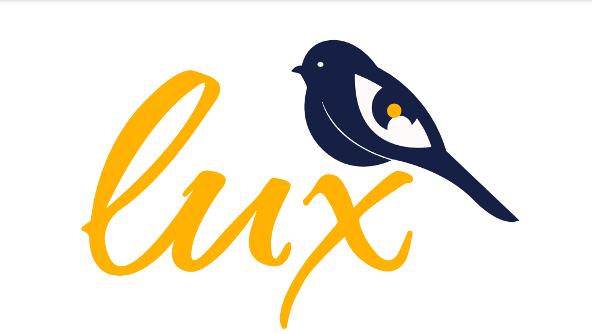

# Bootcamp - Startup Agency

A responsive website for a professional design agency with an original logo and tagline. The website will include a fully animated video to advertise the startup.

Notable features will be: an original video, an original logo and tagline, and custom functionality to showcase each team member.

This website is written with HTML5, styled with CSS3 and will feature Javascript animations throughout.

## Prerequisites

Website should be compatible with most web browsers. Any browsers not supporting CSS Grid and Flexbox may affect how the website renders.

## Contributing

1. Fork it
2. Create your feature branch: `git checkout -b my-new-feature`
3. Commit your changes: `git commit -m 'Add some feature'`
4. Push to the branch: `git push origin my-new-feature`
5. Submit a pull request (please include detailed explanation of any changes)

## Credits

Authors:
- Krystal Furlani
- Zhihan Chen
- Hannah Di Renzo
- Jessica Hernandez Botero

## Credits

Tutorials Used:

- Page Hero Background Video (https://docs.generatepress.com/article/page-hero-background-video/)
-

*All tutorials were significantly tweaked to fit the project.

## License

MIT
